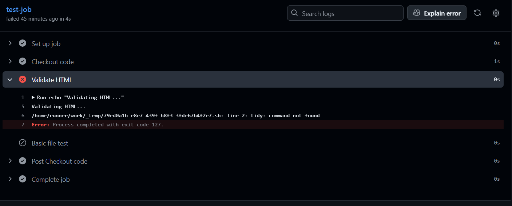
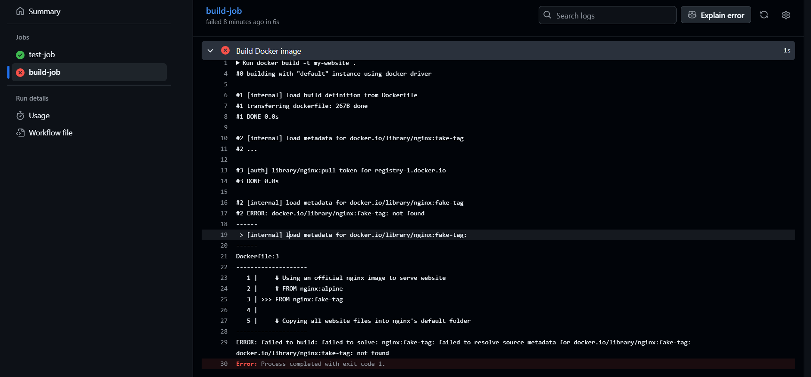

# Part A: Working Pipeline Analysis

Our CI/CD workflow runs whenever we push to the main branch.  

It has two jobs:

1. **test-job**: Checks HTML, and ensures the site can run via a simple local server test.

2. **build-job**: Builds the Docker image for Ant-Attack, and depends on test-job (`needs: test-job`). This ensures we only build if tests pass.

The `needs:` keyword enforces that build-job runs **after** test-job succeeds.

# Part B: Break and Fix Challenge

## Step 1: Dependency Error
During testing, the workflow failed with exit code 127 because some commands (`tidy`, `curl`, `python3`) were not available on the GitHub runner.  



**Fix:** I installed the missing dependencies with:

```bash
sudo apt-get update
sudo apt-get install -y python3 curl tidy 
```


## Step 2: Optional Dockerfile Bug
I also introduced a fake base image:

```bash
FROM nginx:fake-tag
```

Docker failed with:

failed to build: failed to solve: nginx:fake-tag: failed to resolve source metadata for docker.io/library/nginx:fake-tag: 


**Fix:** Corrected it to a valid base image:

```bash
FROM nginx:alpine
```

Workflow turned green after the fix.
